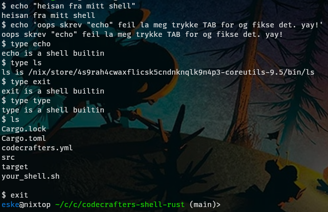
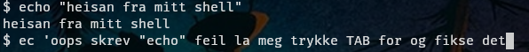
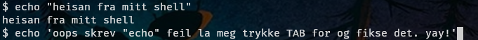

# Shell

## Run
- last ned (rust compiler)[https://www.rust-lang.org/tools/install]
- clone repo: https://github.com/Esk3/rustis
- cargo run

## Features
- inebygget shell kommandoer
    - cd: change directory
    - pwd: print working directory
    - exit
    - type: print kommando typen (shell inebygget eller executable binary i PATH)
    - echo: echo tilbake input
- autocomplete for inebyget kommandoer: skriv begyndelsen av en kommando og trykk TAB for og fulføre den. det funker og hvis du trykker tab etter at du har begynt og skrive argumentene til kommandoen.

- kjør instalerte programer: hvis kommandoen du skriver ikke er en shell kommando og det er en fil i din PATH med samme navn da vil det bli kjørt
